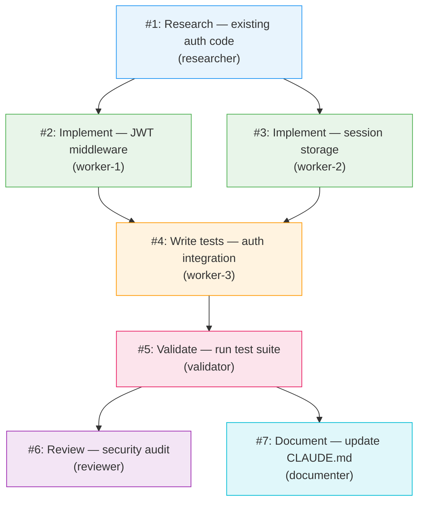

# Orchestrator Redesign Research — Issue #111
*Researcher: auto-generated, April 2, 2026*

---

## Problem Statement

Issue #111 raises three related problems with PDS's current orchestration model:

1. **Wasted capacity**: The main session acts as orchestrator. During worker execution, the orchestrator is idle — Opus-class tokens are paid for but the model is doing nothing. This is both cost-inefficient and a misuse of the most capable tier.

2. **Stalling**: The orchestrator can become unresponsive while waiting for workers. No polling mechanism forces re-engagement.

3. **Opacity**: Task decomposition is invisible to the human. There is no way to see the DAG of planned work before workers start or track it during execution.

---

## Current Architecture

```
Human → Main session (Opus, orchestrator role)
             ↓ spawns
         Worker 1 (Sonnet)    Worker 2 (Sonnet)    Worker 3 (Sonnet)
             ↓ reports via TaskUpdate
         Main session waits (idle, consuming context, burning Opus capacity)
```

**Problem:** The main session is the only session the human can interact with directly. While workers run, this session blocks on `await worker results` — it can't be used for anything else. Opus sits idle.

---

## Proposed Architecture: Dedicated Spawned Orchestrator

```
Human → Thin parent session (Sonnet or Haiku — cheap, interactive)
             ↓ spawns
         Orchestrator Agent (Opus — only runs when coordinating)
             ↓ spawns
         Workers (Sonnet/Haiku — implementation)
             ↓
         Orchestrator synthesizes → parent reports to human
```

The orchestrator becomes a **spawned agent with a defined lifecycle**:
1. Human gives task to parent session
2. Parent spawns orchestrator agent (`Agent(subagent_type="pds:orchestrator", ...)`)
3. Orchestrator decomposes, spawns workers, tracks tasks, synthesizes
4. Orchestrator reports back to parent when complete
5. Parent summarizes for human

**Opus capacity is used only during orchestration decisions, not during worker execution.**

---

## The Human Interaction Trade-Off

This is the critical trade-off raised in Issue #111:

> **A spawned orchestrator agent cannot interact with the human directly. All communication flows through the parent session.**

Claude Code's architecture enforces this. From the source analysis (`AgentTool.tsx`, `runAgent.ts`):
- Spawned agents run in isolated subprocess contexts
- Spawned agents communicate via `SendMessage` (to other agents) and `TaskUpdate` (to shared task list)
- User-facing interaction happens in the main session only

**What this means for PDS:**

| Interaction Type | Current (Main = Orchestrator) | Proposed (Spawned Orchestrator) |
|-----------------|------------------------------|--------------------------------|
| Human clarifies requirements mid-swarm | Direct — orchestrator responds | Indirect — orchestrator → parent → human → parent → orchestrator |
| Human sees task progress | Via TaskList in main session | Via TaskList (same, agents share task system) |
| Human steers a worker | Can message orchestrator → worker | Can message parent → orchestrator → worker (one extra hop) |
| Human aborts mid-swarm | Stops main session | Stops main session, parent signals orchestrator |

**Verdict:** The extra message hop is acceptable for batch-style swarms (most PDS use cases). It is **not** acceptable for highly interactive swarms where human steering is frequent. The current architecture should remain the default; the spawned orchestrator should be an opt-in mode for long-running autonomous swarms.

---

## Polling Mechanism and Stalling

### Why Stalling Happens

The orchestrator blocks waiting for `TaskUpdate(status: "completed")` from workers. If a worker:
- Encounters an unexpected error and exits silently
- Gets stuck in a tool call loop
- Loses its context mid-task

...the task never gets marked complete. The orchestrator waits forever. This is the stalling condition described in Issue #111.

### Claude Code's Built-In Mechanism: TeammateIdle

From the source analysis and Agent Teams docs, the `TeammateIdle` hook fires when a teammate finishes and has no work. Exit code 2 from this hook sends feedback and keeps the teammate working. This is the platform's intended stall-detection mechanism.

**However, `TeammateIdle` is for when a teammate runs out of work — not when a teammate is stuck on a task.** The gap: a hung worker is still nominally "working" (it hasn't gone idle) even though its task will never complete.

### Recommended Polling Strategy

Three complementary mechanisms:

**1. TaskCompleted Hook with Timeout Detection**

Add a `TaskCompleted` hook that records completion timestamps. If a task remains `in_progress` beyond a threshold (e.g., 10 minutes), the hook fires a `systemMessage` to the orchestrator: "Task [id] has been in_progress for 10 minutes. Consider nudging worker."

```json
{
  "TaskCompleted": [{
    "type": "command",
    "command": "hooks/scripts/task-stall-detector.sh"
  }]
}
```

**2. TeammateIdle Hook with Re-Engagement**

When a teammate idles, the `TeammateIdle` hook checks if any `in_progress` tasks belong to this teammate. If yes, send a nudge message to re-engage:

```bash
# In teammate-idle.sh:
STUCK_TASKS=$(jq '[.tasks[] | select(.status == "in_progress" and .owner == env.TEAMMATE_NAME)] | length' "$TASK_FILE")
if [ "$STUCK_TASKS" -gt 0 ]; then
  echo '{"continue": false, "decision": "block", "stopReason": "You have in-progress tasks. Continue working on them."}'
fi
```

**3. Orchestrator Heartbeat**

The orchestrator checks task status every N turns (N=3 recommended). If a worker task hasn't moved in the last check cycle, the orchestrator sends a direct message via `SendMessage`:

```
SendMessage(to: "worker-1", message: "Status check: your task #3 has been in_progress since last check. What is your current progress?")
```

This is the simplest mechanism and requires no additional hooks.

---

## DAG Visualization

### Why It Matters

The human has no visibility into how the orchestrator decomposed the work. Before workers start running, they should be able to see: what tasks were created, which tasks depend on which, and what the overall execution shape looks like.

### Mermaid DAG Mockup

When the orchestrator creates tasks, it should produce a Mermaid DAG summary for the human to review before workers are dispatched:



**How to generate this:** The orchestrator, before dispatching workers, outputs a Mermaid block to the parent session. The parent (which is the human-facing session) renders it in the terminal or IDE. This requires no infrastructure — the orchestrator just prints the diagram as part of its planning output.

### Integration with Plan Mode

Combining DAG visualization with plan mode:
1. Orchestrator runs in plan mode initially
2. Generates DAG diagram as part of the plan
3. Human reviews and approves the plan (via `plan_approval_response`)
4. Orchestrator exits plan mode and dispatches workers

This gives human oversight of task decomposition before any tokens are spent on implementation.

---

## Comparison with Claude Code's Built-In Task Tracking

| Feature | Claude Code Native | PDS Swarm (Current) | PDS Swarm (Proposed) |
|---------|-------------------|--------------------|--------------------|
| Shared task list | TaskCreate/List/Update | ✅ Uses native | ✅ Same |
| Task dependencies (blockedBy) | ✅ addBlockedBy | ✅ Uses native | ✅ Same |
| DAG visualization | ❌ No native viz | ❌ None | ✅ Mermaid output |
| Stall detection | ❌ No built-in | ❌ None | ✅ Heartbeat + hooks |
| Orchestrator isolation | N/A (lead is main) | ❌ Main session | ✅ Spawned agent |
| Human-orchestrator interaction | Direct | Direct | Indirect (one hop) |
| Plan approval before dispatch | Via plan mode | Ad-hoc | ✅ Formalized |

Claude Code's Agent Teams (experimental, v2.1.32+) is the platform's answer to multi-agent orchestration. It shares the same limitation: **the team lead is always the main session** — there is no "spawned lead" model in Agent Teams. PDS's proposed architecture goes beyond what Agent Teams provides.

Notable Agent Teams limitations that are relevant to PDS:
- No session resumption with in-process teammates
- Task status can lag (confirmed stalling issue)
- No nested teams (teammates can't spawn their own teams)
- Lead is fixed for team lifetime

---

## Implementation Approach

### Option A: Spawned Orchestrator Mode (Opt-In)

Add `orchestrator_mode: "spawned"` as a configurable option in `/pds:swarm`. When enabled:
1. Parent session uses Haiku (cheap, interactive-only)
2. Parent spawns `pds:orchestrator` agent with Opus model
3. Orchestrator runs full 6-phase SDLC
4. Parent relays status to human

**Pros:** Opus capacity only used when making coordination decisions. Human interaction degrades gracefully (one extra hop).
**Cons:** Requires changes to orchestrator agent definition. Initial implementation effort ~50-100 lines.

### Option B: Heartbeat Protocol (No Orchestrator Change)

Keep main session = orchestrator. Add the stall-detection heartbeat to the current model:
1. Orchestrator checks task ages every 3 turns
2. Sends nudge messages to workers that haven't updated in >5 minutes
3. Escalates to human if worker doesn't respond to two nudges

**Pros:** Zero architecture change. ~20 lines of orchestrator prompt update.
**Cons:** Does not address Opus capacity waste.

### Recommendation

**Implement Option B immediately** (heartbeat protocol — low effort, high impact for stalling).
**Design Option A** (spawned orchestrator) for a future release — it requires careful planning for the human-interaction degradation and is a non-trivial architecture change.

---

## Recommendations

1. **Implement heartbeat protocol in orchestrator** — Prompt-level change: orchestrator checks task ages every 3 turns and sends nudge messages to stalled workers. No new infrastructure needed.

2. **Add Mermaid DAG output to Phase 1** — When orchestrator completes task decomposition, output a Mermaid diagram before dispatching workers. Add to `/pds:swarm` Phase 1 protocol. Zero infrastructure cost.

3. **Formalize plan-approval + DAG as the Phase 1 exit gate** — Phase 1 ends when the human approves the task DAG. This replaces the current ad-hoc "orchestrator decides when to start workers" model.

4. **Add `TeammateIdle` hook for stall re-engagement** — Short shell script: if an idling teammate has `in_progress` tasks, block idle and send nudge. <50 lines, implementable.

5. **Document spawned orchestrator as a future architecture target** — Record the trade-off (Opus efficiency vs. human interaction cost). Do not implement until heartbeat + DAG are proven stable.

---

## Next Steps

- [ ] Update orchestrator agent definition to include heartbeat protocol (every 3 turns: check task ages, nudge stalled workers)
- [ ] Update `/pds:swarm` Phase 1 to output Mermaid DAG before worker dispatch
- [ ] Add `TeammateIdle` hook for stall re-engagement to `hooks/hooks.json`
- [ ] Create design doc for spawned orchestrator mode (Option A) for future sprint
- [ ] Issue #111 can be closed once heartbeat + DAG are implemented

---

*Sources: [Claude Code agent teams docs](https://code.claude.com/docs/en/agent-teams) · [Claude Code source analysis](./claude-code-source-analysis.md) · [PDS dispatch skill](../skills/dispatch/SKILL.md) · [ComposioHQ agent-orchestrator](https://github.com/ComposioHQ/agent-orchestrator)*
