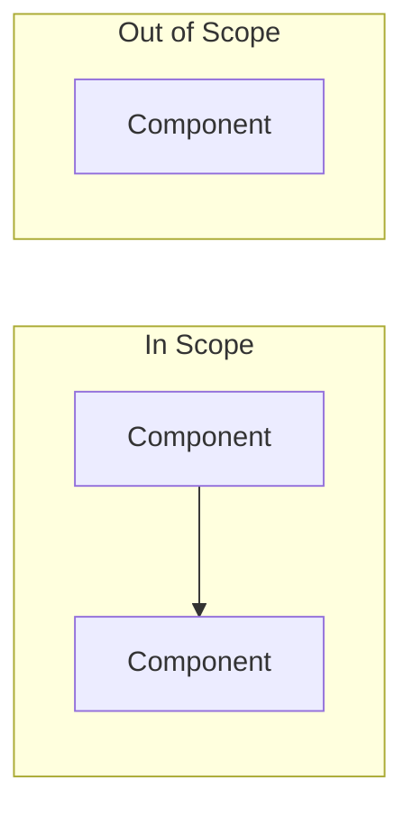
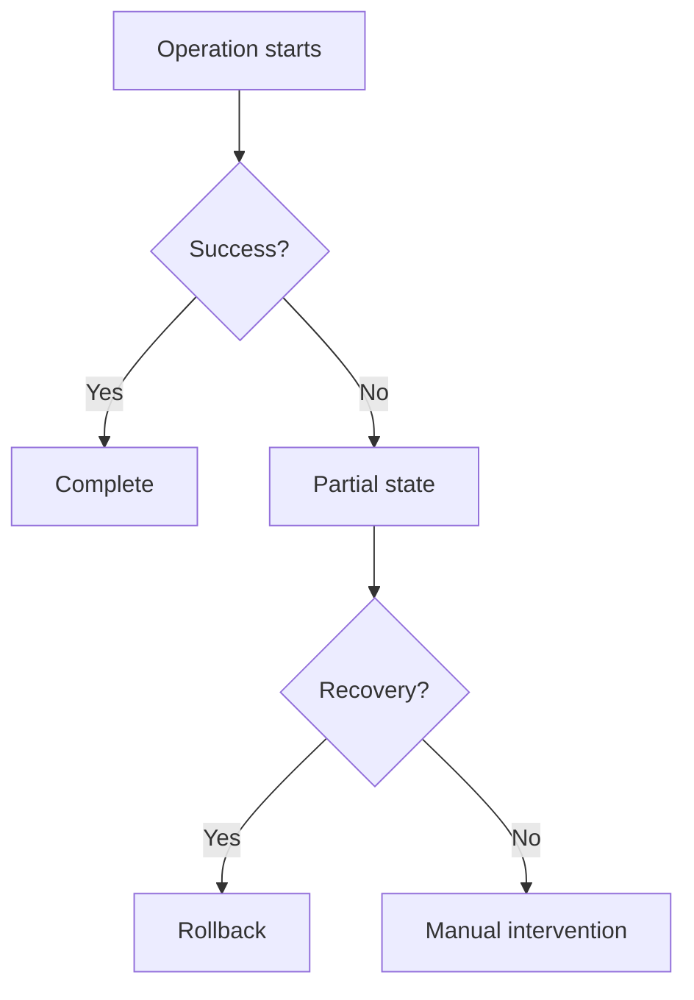

# /grill — Requirement Interrogation

Structured process for validating requirements before implementation. Ambiguous requirements are the #1 source of wasted tokens — a swarm that builds the wrong thing costs 10x more than grilling first.

## Mode

**Always run grill as a plan with Q&A.** Before starting, enter plan mode (`EnterPlanMode`). Grill is a structured conversation — the agent asks questions, the human answers, and each step builds on prior answers. No file writes, no code edits, no tool calls beyond search/read.

**Format:** For each step, the agent:
1. States its analysis or best-guess interpretation
2. Asks specific clarifying questions to the human
3. Waits for the human's response before advancing
4. Uses **mermaid diagrams** where they clarify scope, architecture, dependencies, or data flow

Do not skip steps or combine them. Do not proceed past a step without the human's input — the structured Q&A prevents premature convergence and surfaces assumptions early.

## When to Use

- Before `/pds:swarm` decomposition (Phase 1 references this)
- Before architecture decisions on ambiguous features
- When a task description feels incomplete or assumes too much
- When scope creep risk is high
- When debugging: write your hypothesis before investigating (what you think is happening, evidence that would confirm/disprove)

## Protocol

### 1. Restate
Restate the problem in your own words. If the requirement is vague, state your best interpretation and ask the human to confirm or correct.

> "Here's what I understand the problem to be: [concrete restatement]. Is that right, or am I missing something?"

### 2. Boundary
Draft in-scope and out-of-scope lists based on your understanding. Ask the human to confirm boundaries.

Include a **mermaid diagram** showing the architecture boundary — what's inside scope vs. outside:

> "I'm drawing the boundary here: [in/out lists]. Does this match your intent?"

### 3. Success
Propose mechanically verifiable acceptance criteria — even if the requirement is vague. "Works correctly" is not a criterion. Propose concrete candidates and ask the human to validate:

> "Here are the criteria I'd use to verify this is done:
> 1. [specific, testable criterion]
> 2. [specific, testable criterion]
> Do these capture what success looks like?"

If the requirement is too ambiguous for exact criteria, propose your best-guess criteria and flag them as assumptions.

### 4. Constraints
Identify hard limits and ask the human to confirm or add more:
- Technology (language, framework, existing patterns)
- Time (deadline, token budget)
- Resources (which agents, how many workers)
- Compatibility (APIs, versions, existing interfaces)

> "These are the constraints I see: [list]. Anything else I should know?"

### 5. Assumptions
List each assumption explicitly, then challenge it with a question to the human:
- "I'm assuming the database schema won't change — is that true?"
- "I'm assuming tests cover the adjacent code — do they?"
- "I'm assuming the API contract is stable — is it documented?"

### 6. Risks
Identify what could make this fail. Include a **mermaid diagram** for complex dependency or failure chains:

For each major operation, ask the human:
- **Error-state risks**: What happens when this operation fails mid-execution?
- What partial state is left behind? Is it detectable? Is it recoverable?
- Is there a rollback strategy? What does it cost?

> "The main risk I see is [X]. What's the recovery plan if this fails partway through?"

### 7. Priority
Propose a priority ranking and ask the human to adjust:
- **Must** — ship is blocked without this
- **Should** — expected but deferrable
- **Could** — nice to have

> "Here's my proposed priority ranking: [list]. Does this match your priorities?"

### 8. MECE Check
Check that requirements don't overlap and all cases are covered. Surface any gaps:
- Gaps: what happens when X and Y are both true?
- Overlaps: do two requirements contradict each other?
- Edge cases: empty inputs, concurrent access, error states

> "I found [N] potential gaps: [list]. Should we address these now or defer?"

### 9. Scope Enumeration
Before proceeding to implementation planning, enumerate the full blast radius:
- **Search pass.** Use Grep/Glob to find ALL files, functions, and patterns affected by the planned change.
- **List explicitly.** Write out every file path and occurrence count. No "and similar files" — list them all.
- **Cross-reference.** Check that acceptance criteria cover every affected file/pattern.
- If no codebase is available, describe the enumeration approach: what to search for, where to look, what patterns to match.

> "The change affects [N] files across [M] modules: [list]. Did I miss any?"

### 10. Swarm Decision + Tier

Based on the validated requirements, decide execution strategy:

**No-swarm when:**
- Changes stay within a single module or boundary
- No parallelism opportunity — changes are sequential/dependent
- Single agent can complete in ~30 turns or less

**Swarm when** changes cross module boundaries or benefit from parallel execution. Select tier:

**Lite** — routine, pattern-following:
- Crosses 2 modules but follows existing patterns (add X like existing Y)
- Low ambiguity — requirements clear after steps 1-9
- No new interfaces between modules
- Example: new API endpoint + tests when many similar endpoints exist

**Med** — non-trivial, multi-boundary:
- Crosses 2-3 architecture boundaries
- Moderate complexity — some design decisions needed
- May add new interfaces within existing conventions
- Example: new feature touching API + database + frontend

**Heavy** — complex, high-stakes:
- Crosses 3+ architecture boundaries
- Requires new interfaces or contracts between modules
- Refactors a core abstraction other code depends on
- Significant risk items identified in step 6
- Example: replacing an auth system, new data pipeline, major API redesign

**Output:** Explicit `Recommendation: swarm (tier: lite)` or `swarm (tier: med)` or `swarm (tier: heavy)` or `no-swarm` — with rationale. If swarm, include a decomposition outline (task count, boundaries, dependencies).

## Output

After completing the Q&A, synthesize a validated problem statement:
- Restated problem (1-2 sentences, confirmed by human)
- Scope boundary (in/out lists with architecture diagram)
- Acceptance criteria (mechanically verifiable, human-approved)
- Constraints and assumptions (explicit, challenged)
- Priority ranking (must/should/could)
- Risk analysis with error-state coverage (with diagrams for complex flows)
- Scope enumeration (affected files/patterns with counts)
- Swarm decision with tier (swarm + lite/med/heavy, or no-swarm, with rationale)

This feeds directly into `/pds:swarm` Phase 1 tier initialization and Phase 2 decomposition.

## See Also

- `/pds:swarm` — Phase 1 runs /grill before decomposition
